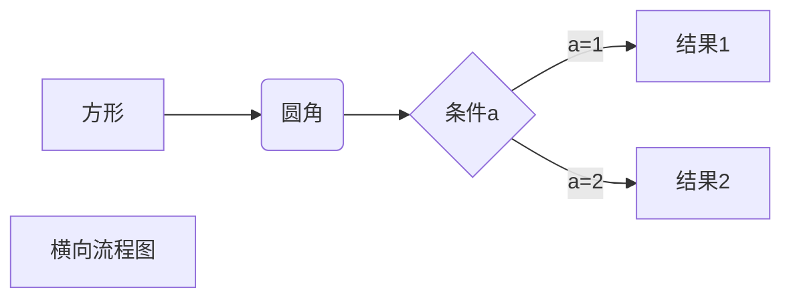

# 转移字符
如果你想输出转移符号比如*，{}，太多我不列举了这些等等主需要在前面加\即可
\*星号 \(\)括号

# 公式
矩阵：
$$
\begin{Bmatrix}
   a & b \\
   c & d
\end{Bmatrix}
$$
矢量图：
$$
\begin{CD}
   A @>a>> B \\
@VbVV @AAcA \\
   C @= D
\end{CD}
$$

# 流程图 我觉得这个万一还是自己画好了，在传图片上去把，太麻烦了
